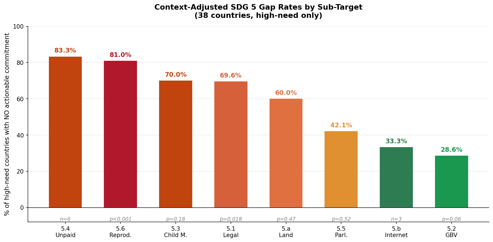
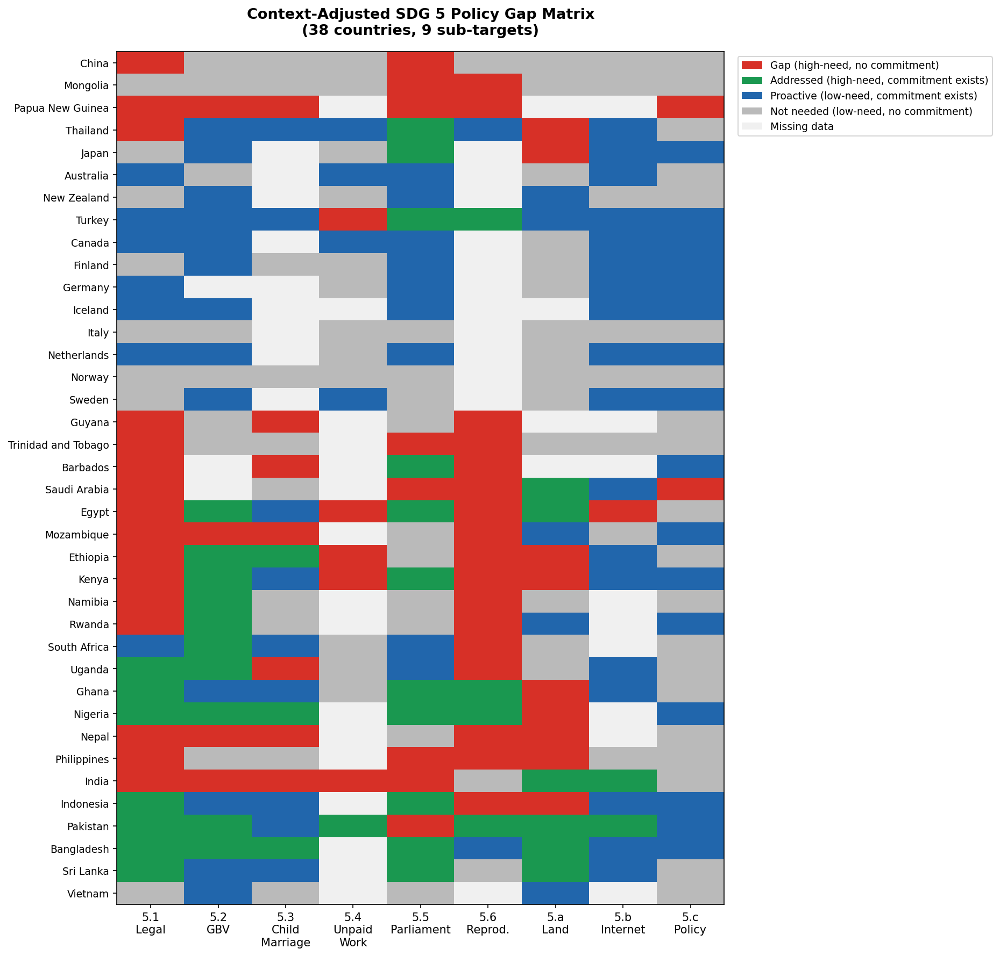

# The Silence of Policy
### Mapping Context-Adjusted SDG 5 Coverage Gaps in UN Voluntary National Reviews

**CSSM 550 — Special Topics in Computational Social Science and Media**  
Şevval Çakıcı · Koç University · Spring 2025  
Instructor: Merih Angın

---

## Overview

This project introduces a **context-adjusted measure of policy silence** for SDG 5 (Gender Equality). When a country does not address a particular gender issue in its UN Voluntary National Review (VNR), this may reflect genuine policy failure — or simply the absence of that problem domestically. Existing monitoring frameworks cannot distinguish between these two interpretations.

This pipeline distinguishes **meaningful silence** from **legitimate silence** by conditioning analysis on internationally verified need thresholds for each SDG 5 sub-target.

> *"Not all silence is equal."*

---

## Key Findings

| Sub-target | High-need countries with NO actionable commitment | p-value |
|---|---|---|
| **5.6 Reproductive rights** | **81.0%** | p < 0.001 |
| 5.4 Unpaid care work | 83.3% | n=6 |
| 5.3 Child marriage / FGM | 70.0% | p = 0.18 |
| **5.1 Legal discrimination** | **69.6%** | **p = 0.018** |
| 5.a Land & asset rights | 60.0% | p = 0.47 |
| 5.5 Political participation | 42.1% | p = 0.52 |
| 5.b Technology access | 33.3% | n=3 |
| **5.2 Gender-based violence** | **28.6%** | p = 0.06 |

**GGI quartile does not predict silence** — Kruskal-Wallis p=0.629. Income inequality does not explain which countries are more likely to avoid actionable commitments.

## Visualisations


*Figure 1. Context-adjusted gap rates by SDG 5 sub-target (38 countries, high-need only)*


*Figure 2. Context-adjusted SDG 5 policy gap matrix (38 countries × 9 sub-targets)*

---

## Repository Structure

```
silence-of-policy/
│
├── silence_of_policy_pipeline.ipynb   # Full NLP pipeline (Google Colab)
├── index.html                         # Interactive web tool
└── README.md                          # This file
```

---

## Pipeline

The analysis runs in three stages:

### Stage 1 — Extraction & Tagging
- 42 VNR PDFs (2018–2023) extracted using `pdfplumber`
- Gender relevance filter (keyword-based, recall-prioritized)
- Sub-target tagging via keyword matching + sentence embeddings
- **Result:** 2,131 gender-relevant paragraphs

### Stage 2 — Commitment Classification
- Each paragraph classified as `mention only` or `actionable commitment` using GPT-4o-mini
- **Actionable commitment** requires: named responsible actor + specified policy action + temporal or measurable target
- Classification includes surrounding paragraph context to avoid false negatives
- **Result:** 5.4% actionable (116 / 2,131)

### Stage 3 — Gap Analysis
- Need determined by comparing country benchmarks to internationally defined thresholds (not sample-relative medians)
- **Context-adjusted gap score** = proportion of high-need sub-targets with no actionable commitment
- Chi-square tests per sub-target; Kruskal-Wallis for regional and GGI quartile variation

---

## Data Sources

| Sub-target | Indicator | Source | Threshold |
|---|---|---|---|
| 5.1 Legal discrimination | Women, Business and the Law index | World Bank (2024) | Score < 75 |
| 5.2 Gender-based violence | IPV prevalence (12-month, %) | WHO via Our World in Data (2021) | > 10% |
| 5.3 Child marriage / FGM | Girls married before 18 (%) | UNICEF (2023) | > 20% |
| 5.4 Unpaid care work | Gender gap in unpaid work (hr/day) | World Bank WDI / ILOSTAT (2023) | > 3 hr/day |
| 5.5 Political participation | Women in parliament (%) | IPU Parline (2024) | < 30% |
| 5.6 Reproductive rights | Unmet need for family planning (%) | World Bank WDI / UN Pop. Div. (2022) | > 10% |
| 5.a Land & asset rights | Women's land rights score | OECD SIGI (2023) + FAO GLRD | SIGI > 0.3 |
| 5.b Technology access | Gender gap in internet use (pp) | ITU via World Bank WDI (2023) | > 10 pp |
| 5.c Gender-responsive policy | Women's political empowerment index | V-Dem v16 (2023) | Score < 0.5 |

VNR documents sourced from: [UN SDG Knowledge Platform](https://hlpf.un.org/countries)

---

## Country Sample

42 countries selected via stratified purposive sampling across 4 GGI quartiles × 6 geographic regions (WEF Global Gender Gap Report 2023).

| Region | Q1 | Q2 | Q3 | Q4 |
|---|---|---|---|---|
| Europe & N. America | Iceland, Norway, Finland, Sweden, Germany | France*, Canada | Italy, Netherlands | Turkey |
| East Asia & Pacific | New Zealand, Australia | Mongolia | China, Thailand | Japan, Papua New Guinea |
| Latin America & Carib. | Barbados | Guyana | Saint Lucia | Trinidad and Tobago |
| Sub-Saharan Africa | Namibia, Rwanda | South Africa, Mozambique | Ghana, Kenya, Uganda | Nigeria, Ethiopia |
| South & SE Asia | — | Philippines, Sri Lanka | Indonesia, Vietnam | Bangladesh, Nepal, India, Pakistan |
| MENA | — | — | Kuwait, UAE | Egypt, Saudi Arabia, Bahrain |

*France removed: French-only VNR. Tanzania removed: poor PDF quality. 4 countries (Kuwait, Bahrain, Saint Lucia, UAE) excluded from primary analysis due to insufficient benchmark coverage (< 5 valid sub-targets).

---

## Qualitative Validation

Four outlier cases were selected for close reading:

| Country | Gap Score | Pattern | Theoretical Link |
|---|---|---|---|
| **Bangladesh** | 0.0 | Transformative commitment | Walby (2005) |
| **Sri Lanka** | 0.0 | Positive outlier | Walby (2005) |
| **Guyana** | 1.0 | Meaningful silence | Bumiller (2008) |
| **Saudi Arabia** | 0.8 | Selective mainstreaming | Lombardo et al. (2009) |
| **Norway** | N/A | Norm diffusion (no domestic need) | True & Mintrom (2001) |

---

## Theoretical Framework

- **Lombardo, Meier & Verloo (2009)** — *Selective mainstreaming*: gender rhetoric enters policy documents while structurally challenging issues are left without actionable language.
- **Bumiller (2008)** — *Silence as political choice*: when governments stay silent, it reflects the limits of what they are willing to commit to publicly.
- **True & Mintrom (2001)** — *Norm diffusion*: countries may produce gender equality language because of international normative pressure, not domestic need.
- **Walby (2005)** — *Integrationist vs. transformative* approaches to gender mainstreaming.
- **Htun & Jensenius (2022)** — Caution against treating rhetorical inclusion as evidence of substantive progress.

---

## How to Run

1. Upload your VNR PDFs to Google Drive
2. Download benchmark CSVs from the sources listed above and upload to Drive
3. Open `silence_of_policy_pipeline.ipynb` in Google Colab
4. Update the path variables in the Setup cell
5. Add your OpenAI API key as a Colab secret named `CSSM550`
6. Run cells sequentially

**Estimated runtime:** ~25 minutes (GPT-4o-mini classification of 2,131 paragraphs)  
**Estimated cost:** ~$0.08 (GPT-4o-mini API)

---

## Citation

```
Çakıcı, Ş. (2025). The Silence of Policy: Mapping Context-Adjusted SDG 5 Coverage Gaps
in Voluntary National Reviews Across 42 Countries. Capstone Project, CSSM 550,
Koç University.
```

---

## License

This project is submitted for academic purposes at Koç University. Data sources retain their respective licenses (World Bank Open Data, V-Dem CC BY 4.0, OECD Terms and Conditions, etc.).
